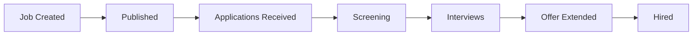

The ATS Platform structures your entire hiring process as a sequential, trackable workflow — one that your team can customize to match how you actually hire. Every open role you create moves through a series of well-defined stages, and every candidate associated with that role has a clear position in your pipeline at all times. This page walks you through the seven stages of a standard hiring lifecycle, explains how candidates move between stages, and shows you where automation can reduce manual work.

## The 7-Stage Hiring Lifecycle

<Steps>
  <Step title="Job Creation">
    Define the role you're hiring for by entering a job title, department, location (or remote designation), employment type, and compensation range. You'll also configure the pipeline stages specific to this role — for example, a technical role might include a coding assessment stage that a sales role wouldn't need. Attach a job description, set internal approval requirements if applicable, and assign a hiring manager and recruiting owner before moving forward.
  </Step>
  <Step title="Job Publishing">
    Once a job is drafted and approved, publish it to your organization's branded careers page and any connected job boards (LinkedIn, Indeed, Greenhouse, and others via your configured integrations). You control which channels each job is posted to and can schedule publish and unpublish dates. All inbound applications from every source are automatically consolidated into the ATS so you work from a single queue.
  </Step>
  <Step title="Application Intake">
    When a candidate submits an application — through your careers page, a job board, or a direct link — the ATS Platform captures their profile, parses their resume, and creates a new Application record linked to that job. The system automatically sends a confirmation email to the candidate acknowledging receipt, using your configured email template. You can customize the acknowledgment copy in **Settings → Email Templates**.
  </Step>
  <Step title="Screening & Review">
    Recruiters review incoming applications in the Pipeline view, where each candidate appears as a card in your first pipeline stage (typically "Applied" or "New"). You can view the parsed resume, add internal notes, apply tags, and assign a score or disposition. Move qualified candidates forward to the next stage manually, or configure automated rules — such as advancing everyone who meets a minimum screen score — to accelerate the process. Disqualified candidates receive a rejection email based on your template settings.
  </Step>
  <Step title="Interview Scheduling">
    Once a candidate reaches an interview stage, you can schedule sessions directly from their Application record. The ATS Platform syncs with Google Calendar and Microsoft 365 to display real-time interviewer availability and send calendar invites to all parties automatically. For panel interviews, add multiple interviewers in a single scheduling action. After each interview, interviewers are prompted to complete a structured scorecard, and their ratings and comments are visible to recruiters and hiring managers in the application timeline.
  </Step>
  <Step title="Offer & Acceptance">
    When your team is ready to extend an offer, generate an offer letter directly in the ATS using a pre-approved template populated with the candidate's name, role, compensation, and start date. Route the offer for internal approval if your organization requires it, then send it to the candidate for e-signature via the platform's built-in document signing flow. The candidate receives an email with a secure signing link and can accept, negotiate, or decline from any device. Offer status updates in real time on the Application record.
  </Step>
  <Step title="Hire & Onboard">
    When a candidate accepts their offer, mark them as **Hired** in the ATS. This action closes the application, updates pipeline reporting, and — if you have an HRIS integration configured — automatically pushes the new hire's data to your HR system to trigger your onboarding workflow. The job remains open until you manually close or pause it, so you can continue evaluating other candidates if you have multiple seats to fill.
  </Step>
</Steps>

## Workflow Diagram

The diagram below illustrates how a role and its candidates progress from start to finish in the ATS Platform.

## Stage Transitions

Candidates move between pipeline stages in two ways: **manually** by a recruiter or hiring manager, or **automatically** via rules you configure.

### Manual Transitions

Any team member with edit access to a job can drag a candidate card from one stage to the next in the Pipeline board view, or use the **Move to Stage** dropdown inside an Application record. Each transition is logged in the application's activity timeline with a timestamp and the name of the user who made the change. You can also move multiple candidates at once using bulk actions in the list view.

### Automated Transitions

Automation rules let you define trigger-based stage movements so your team spends less time on routine actions. For example:

- **Advance on score** — Automatically move candidates who receive a screening score above a threshold to the next stage.
- **Reject on disqualifier** — Move candidates to a rejection stage if a knockout question is answered unfavorably.
- **Schedule reminder** — Trigger a task for the recruiter if a candidate has been in a stage for more than a set number of days without activity.

You configure automation rules per pipeline stage in **Settings → Pipeline Stages**.

<Note>
  You can create and modify pipeline stages — including adding custom stages unique to a specific job or role type — in **Settings → Pipeline Stages**. Changes to a pipeline template apply to all future jobs using that template but do not retroactively move candidates in existing jobs. See the [Pipeline Stages configuration guide](/configuration/pipeline-stages) for details.
</Note>

## Related Pages

<CardGroup cols={2}>
  <Card title="User Roles" icon="user-shield" href="/concepts/user-roles">
    Understand who can perform each action in the hiring workflow based on their assigned role.
  </Card>
  <Card title="Pipeline Stages Configuration" icon="sliders" href="/configuration/pipeline-stages">
    Customize the stages in your hiring funnel — rename, reorder, and add automation rules.
  </Card>
  <Card title="Interview Scheduling" icon="calendar-days" href="/manual/interview-scheduling">
    Step-by-step instructions for scheduling interviews and collecting scorecards.
  </Card>
  <Card title="Offers & Hiring" icon="file-signature" href="/manual/offers-and-hiring">
    How to generate, approve, and send offer letters and track acceptance.
  </Card>
</CardGroup>
