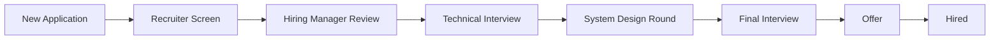

A hiring pipeline is the sequence of stages a candidate moves through from initial application to final hiring decision. ATS Platform gives you full control over how those stages are structured, named, and automated — because no two roles, teams, or hiring processes are exactly the same. Customizing your pipelines to mirror how your team actually evaluates candidates reduces manual work, keeps every stakeholder aligned, and ensures candidates receive timely communication at every step.

## Default Pipeline Stages

Every new ATS Platform account comes with a ready-to-use **Default Pipeline** that covers the most common hiring workflow. You can use this pipeline as-is for any job, or use it as a starting point when building custom pipelines. The default stages are:

| Stage | Stage Type | Description |
|---|---|---|
| New Application | Review | Candidate has applied; awaiting initial review |
| Screening | Review | Recruiter reviews resume and application responses |
| Phone Interview | Interview | Brief call to assess basic fit and interest |
| Technical Interview | Interview | Role-specific skills evaluation |
| Final Interview | Interview | Culture fit and executive/team sign-off |
| Offer | Offer | Offer letter is prepared and sent |
| Hired | — | Candidate has accepted and signed the offer |

<Warning>
If you edit a pipeline that is **actively in use** on one or more jobs, your changes — including renamed stages, reordered stages, or deleted stages — will apply **only to new candidates** who enter the pipeline after your edits are saved. Candidates who are already sitting in a stage at the time of the edit will remain in their current stage and continue through the pipeline using the original stage names. To avoid confusion, consider creating a new pipeline version rather than modifying an active one.
</Warning>

## Creating a Custom Pipeline

Custom pipelines let you tailor the hiring workflow for specific roles, departments, or hiring speeds. For example, an engineering team may need multiple technical rounds, while a sales team may want a faster two-stage screen-and-hire track.

<Steps>
  <Step title="Navigate to Settings → Pipelines → New Pipeline">
    Open **Settings** from the left navigation, select **Pipelines**, and click the **New Pipeline** button in the top-right corner. The pipeline builder interface will open.
  </Step>
  <Step title="Enter a pipeline name">
    Give your pipeline a descriptive internal name that makes it easy to identify when assigning it to a job. Examples: `Engineering Hire`, `Sales Fast Track`, `Executive Search`, `Internship Program`. This name is visible only to your internal team — candidates never see it.
  </Step>
  <Step title="Add, rename, reorder, or delete stages">
    The pipeline builder displays your stages as a horizontal list of cards. Use the following controls to build your workflow:
    - **Add Stage** — Click the **+ Add Stage** button at the end of the pipeline to append a new stage
    - **Rename** — Click directly on any stage name to edit it inline
    - **Reorder** — Drag and drop stages left or right to change their sequence
    - **Delete** — Click the trash icon on a stage card to remove it (you must have at least 2 stages)

    You can build pipelines with as few as 2 or as many as 20 stages.
  </Step>
  <Step title="Configure each stage's settings">
    Click the **settings icon** on any stage card to open its configuration panel. For each stage, you can set:
    - **Stage Name** — The internal and candidate-visible label for this stage
    - **Stage Type** — Select Review, Interview, or Offer (see [Stage Types](#stage-types) below)
    - **Auto-Email Trigger** — Optionally attach an email template that is automatically sent to the candidate when they are moved into this stage. Select from your saved email templates (see [Email Templates](/configuration/email-templates)).
  </Step>
  <Step title="Save and assign to a job">
    Click **Save Pipeline** when your configuration is complete. To assign this pipeline to a job, navigate to the job's settings (**Jobs → [Job Name] → Settings → Pipeline**) and select your new pipeline from the dropdown. You can also assign a pipeline when creating a new job.
  </Step>
</Steps>

## Stage Types

Each stage in your pipeline must be assigned one of three **stage types**. The stage type controls which platform features are unlocked for candidates sitting in that stage, and how automated workflows respond to activity in that stage.

### Review Stage

A **Review Stage** requires a manual recruiter or hiring manager action before the candidate can progress. When a candidate enters a Review stage, the assigned recruiter is notified and the candidate's card is flagged for action in the dashboard. No interview scheduling or offer tools are available until the candidate is manually advanced.

Use Review stages for: initial application screening, resume review, hiring manager sign-off, or any step that requires a human judgment call before the next action.

### Interview Stage

An **Interview Stage** activates the interview scheduling workflow. When a candidate is moved into an Interview stage, you can immediately use the **Schedule Interview** button on their candidate card to select an interviewer, propose time slots, and send a calendar invite. Scorecard templates associated with that stage become available for interviewers to complete after the session.

Use Interview stages for: phone screens, video interviews, technical assessments, take-home assignments (with a manual review follow-up), and panel interviews.

### Offer Stage

An **Offer Stage** unlocks the **Create Offer Letter** button on the candidate's profile. This button is disabled in all other stage types to prevent accidental offer creation. When you enter the Offer stage, the system will prompt you to select an offer letter template, fill in compensation details, and send the offer to the candidate for e-signature.

Only one stage in a pipeline should be designated as the Offer stage. Typically this is the second-to-last stage before **Hired**.

## Automated Stage Transitions

ATS Platform can automatically move candidates from one stage to the next when a defined condition is met, reducing the manual overhead on your recruiting team.

To configure an automated transition, open a stage's settings panel and scroll to the **Auto-Advance Trigger** section. Available trigger conditions include:

- **All scorecards submitted** — When every assigned interviewer has submitted their scorecard for this stage, automatically advance the candidate to the next stage
- **Scorecard average above threshold** — If the average rating across submitted scorecards exceeds a score you define (e.g., 4 out of 5), automatically advance; otherwise, flag for manual review
- **Stage time limit reached** — If a candidate has been in this stage for more than X days without action, automatically move them to a specified stage or send a reminder to the recruiter
- **Assessment score threshold** — If you have connected a third-party assessment tool, automatically advance candidates who meet a minimum score

When an automated transition fires, ATS Platform logs the trigger reason in the candidate's activity timeline so your team always has a clear audit trail.

## Sample Engineering Pipeline

The following diagram illustrates what a well-structured engineering hiring pipeline might look like, with two technical rounds and a system design evaluation:

In this pipeline, **Recruiter Screen** and **Hiring Manager Review** are Review stages, **Technical Interview**, **System Design Round**, and **Final Interview** are Interview stages, and **Offer** is the Offer stage. You might configure the Technical Interview stage with an auto-advance trigger so that candidates with an average scorecard score of 4 or higher automatically move to the System Design Round, keeping your pipeline moving without manual nudges.
