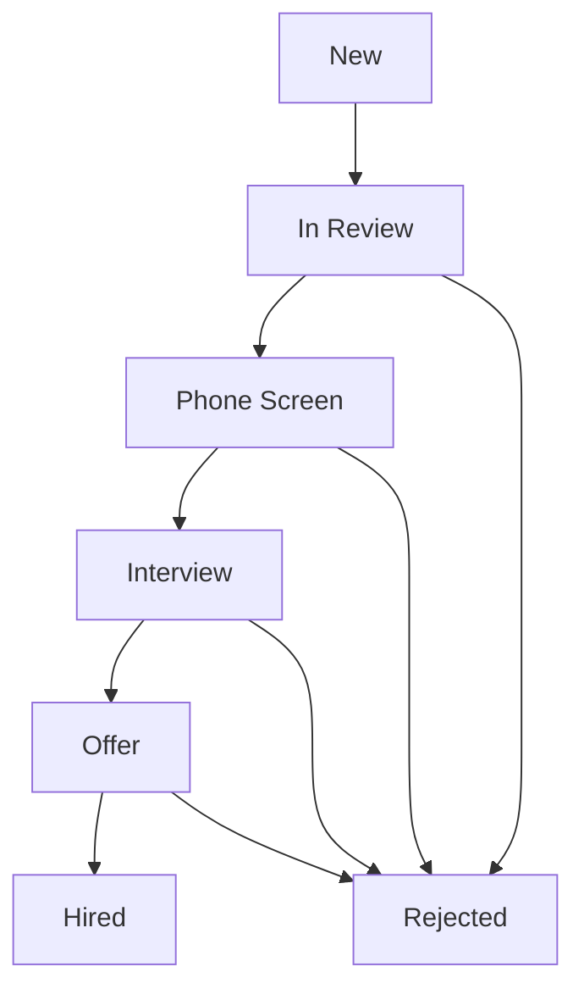

The Candidates module is where your entire talent pipeline lives. Every person who applies to one of your jobs — whether through your careers page, a job board, a manual entry, or a CSV import — has a candidate profile in this module. You can view candidates across all jobs simultaneously or filter down to a single role, switch between a structured list view and a visual Kanban board, take bulk actions on groups of candidates, and access every piece of information about an applicant from a single, consolidated profile page.

<Info>
  The Candidates module in Kanban board view displays candidate cards grouped into columns by pipeline stage (e.g., Applied, Phone Screen, Interview, Offer, Hired). Each card shows the candidate's name, applied role, and any flags or tags. Cards can be dragged between stage columns to advance or revert a candidate's progress.
</Info>

## List View vs. Kanban Board View

The Candidates module offers two display modes, toggled using the view switcher in the top-right corner of the module:

- **List View** — displays candidates in a sortable, filterable table. Each row shows the candidate's name, applied role, current stage, source, application date, and a match score. List view is ideal when you need to scan large volumes of candidates, apply complex filters, or perform bulk actions.
- **Kanban Board View** — displays candidates as cards organized into columns, one column per pipeline stage. Cards show the candidate's name, role, and any flags or tags. Kanban view is ideal for visualizing flow through your pipeline, quickly identifying bottlenecks, and dragging candidates from one stage to the next.

Both views share the same filtering, search, and bulk action capabilities.

## Manually Adding a Candidate

While most candidates enter your pipeline through job applications, you can manually add a candidate at any time — for example, when sourcing directly from LinkedIn or adding a referred candidate.

<Steps>
  <Step title="Navigate to Candidates → Add Candidate">
    From the left navigation sidebar, click **Candidates**, then click the **+ Add Candidate** button in the top-right corner. The candidate creation form will open in a side panel.
  </Step>
  <Step title="Enter Contact Information">
    Fill in the candidate's basic details:
    - **Full Name** (required)
    - **Email Address** (required — used for all communications and deduplication)
    - **Phone Number** (optional)
    - **LinkedIn Profile URL** (optional)
    - **Source** — select where this candidate came from: Direct Sourcing, Employee Referral, LinkedIn, Job Board, Agency, or Other
  </Step>
  <Step title="Upload a Resume">
    Click **Upload Resume** to attach the candidate's resume. The platform accepts **PDF** and **DOCX** files up to 10 MB. Once uploaded, the resume is automatically parsed — the candidate's work history, education, and skills are extracted and pre-populated into the profile. You can review and correct any parsed fields before saving.
  </Step>
  <Step title="Link to Job Applications">
    In the **Applications** section of the form, click **+ Add Application** to associate this candidate with one or more open jobs. For each application, select the target job and the pipeline stage the candidate should start in (defaults to the first stage). A candidate can hold multiple simultaneous applications for different roles.
  </Step>
  <Step title="Save the Candidate">
    Click **Save** to create the candidate profile. The candidate will appear immediately in the Candidates module and in the pipeline view for each job they were linked to. An automated welcome email is not sent for manually added candidates unless you explicitly trigger outreach from the profile.
  </Step>
</Steps>

## Candidate Profile

Each candidate has a comprehensive profile page accessible by clicking their name anywhere in the platform. The profile is organized into five sections:

<Accordion title="Personal Info">
  Contains the candidate's contact details (name, email, phone, location), social profiles (LinkedIn, GitHub, portfolio), source, tags, and any custom fields configured for your account. You can edit any field directly by clicking the pencil icon next to it. Changes are logged in the Timeline automatically.
</Accordion>

<Accordion title="Applications">
  Lists every job this candidate has applied to, along with the current pipeline stage, application date, and a link to the job posting. Click any application row to switch the profile context to that specific role, updating the pipeline stage controls, scorecard, and interview history to reflect that application.
</Accordion>

<Accordion title="Timeline">
  A chronological, tamper-evident log of every action taken on this candidate's profile — stage movements, notes added, emails sent, interviews scheduled, documents uploaded, and team member interactions. The timeline is read-only and cannot be edited or deleted, providing a full audit trail of recruiting activity.
</Accordion>

<Accordion title="Documents">
  Stores all files associated with the candidate: resumes, cover letters, portfolios, assessments, reference letters, and offer letters. Each document entry shows the file name, upload date, uploader, and document type. You can upload new documents at any time and delete documents you uploaded (admins can delete any document).
</Accordion>

<Accordion title="Notes">
  A shared notepad visible to all team members with access to the candidate. Notes support rich text formatting, @mentions to notify colleagues, and optional privacy (mark a note as "Private" to restrict visibility to yourself and admins). Notes appear in the Activity Feed on the main dashboard.
</Accordion>

<Info>
  The candidate profile page is organized into five tabbed sections — Personal Info, Applications, Timeline, Documents, and Notes. The Timeline section shows a chronological, tamper-evident log of all actions taken on the profile (stage moves, emails sent, interviews scheduled, documents uploaded), while the Applications section lists every job the candidate has applied to with their current stage and application date.
</Info>

## Pipeline Stage Actions

Moving candidates through your hiring pipeline is the core workflow in the Candidates module. You can advance or revert a candidate's stage from both the list view and the Kanban board.

- **Move Forward / Backward** — in Kanban view, drag the candidate card to the target stage column. In list view or on the candidate profile, click the current stage badge and select a new stage from the dropdown. You can move a candidate to any stage — not just the immediately adjacent one.
- **Add a Stage Note** — when moving a candidate, you are prompted to add an optional note explaining the reason for the stage change. This note is saved to the Timeline automatically.
- **Flag for Review** — click the flag icon on any candidate card or profile to mark them as needing attention. Flagged candidates appear highlighted in both list and Kanban views and trigger a Task Reminder for the assigned recruiter.
- **Reject a Candidate** — select **Reject** from the stage dropdown or the action menu. You will be asked to select a rejection reason and choose whether to send the candidate an automated rejection email (configured under [Email Templates](/configuration/email-templates)).
- **Reactivate a Rejected Candidate** — if circumstances change, you can reactivate a rejected candidate by navigating to their profile and clicking **Reactivate Application**. This returns them to the stage they were in before rejection.

## Bulk Actions

When managing large candidate pools, bulk actions let you update multiple records simultaneously. To use bulk actions:

1. In list view, check the checkbox to the left of each candidate you want to act on. Use the header checkbox to select all candidates matching your current filters.
2. A bulk actions toolbar will appear at the bottom of the screen, showing the number of selected candidates.
3. Choose from the available bulk actions:

| Bulk Action | Description |
|---|---|
| **Bulk Move Stage** | Moves all selected candidates to a chosen pipeline stage in one operation |
| **Bulk Send Email** | Sends a templated or custom email to all selected candidates simultaneously |
| **Bulk Reject** | Rejects all selected candidates with a chosen rejection reason; optionally sends automated rejection emails |
| **Bulk Tag** | Adds or removes tags on all selected candidate profiles |
| **Bulk Assign** | Reassigns the recruiter or hiring manager for all selected candidates |
| **Bulk Export** | Downloads a CSV file containing profile data for all selected candidates |

<Info>
  When one or more candidates are selected in list view via their checkboxes, a bulk actions toolbar appears at the bottom of the screen showing the count of selected candidates and action buttons for Bulk Move Stage, Bulk Send Email, Bulk Reject, Bulk Tag, Bulk Assign, and Bulk Export. Using the header checkbox selects all candidates matching the current active filters in a single click.
</Info>

## Candidate Sources

Understanding where your best candidates come from is critical to optimizing your recruiting spend. The ATS Platform tracks a source value for every candidate, which flows into the [Source Effectiveness](/manual/reporting-analytics) report. Candidates enter your pipeline through four primary channels:

- **Manual Entry** — added directly by a recruiter or team member through the Add Candidate form, as described above. Source is set manually during entry.
- **Job Board Apply** — candidates who submitted applications through your careers page, LinkedIn, Indeed, Glassdoor, or another connected job board. The source is set automatically based on the originating channel.
- **CSV Import** — bulk import of candidate profiles from a spreadsheet. Navigate to **Candidates → Import → Upload CSV** and download the CSV template to ensure your data is formatted correctly. Source can be specified as a column in the import file.
- **API** — candidates created programmatically via the [Candidates API](/api/candidates). The source value is passed in the API request body and can be any custom string, making this method flexible for integrating with external sourcing tools, ATS migrations, or HRIS systems.

## Application Status Flow

The diagram below shows how a candidate's application status transitions through a typical hiring pipeline.

## Filtering and Searching Candidates

<Tip>
  Use the filter panel (click the **Filters** button above the candidate list) to narrow large candidate lists by pipeline stage, source, application date range, experience level, skills tags, assigned recruiter, or AI match score. You can save any filter combination as a named **Saved View** so you can return to it quickly without re-configuring filters each time. Saved Views appear in the left sidebar of the Candidates module.
</Tip>

## Related Resources

<CardGroup cols={2}>
  <Card title="Interview Scheduling" icon="calendar" href="/manual/interview-scheduling">
    Schedule and manage interviews directly from a candidate's profile.
  </Card>
  <Card title="Offers & Hiring" icon="file-signature" href="/manual/offers-and-hiring">
    Create and send offer letters once a candidate is ready to be hired.
  </Card>
  <Card title="Pipeline Stages" icon="sliders" href="/configuration/pipeline-stages">
    Customize the stages in your hiring pipeline to match your workflow.
  </Card>
  <Card title="Candidates API" icon="code" href="/api/candidates">
    Create, update, and retrieve candidate records via the REST API.
  </Card>
</CardGroup>
