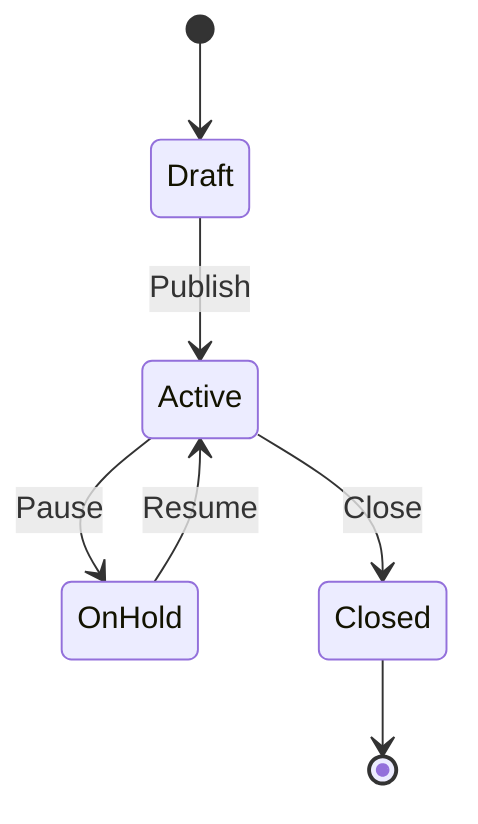

The Jobs module is the starting point for every hire you make in the ATS Platform. It gives you full control over creating job postings, defining the hiring pipeline for each role, assigning team members, and publishing your openings to multiple channels simultaneously. Whether you are managing a single role or coordinating dozens of open requisitions across departments, the Jobs module keeps everything organized in one place and provides a clear view of status and progress for each position.

<Info>
  The Jobs module list view displays all job postings in a sortable table, with columns for Job Title, Department, Location, Employment Type, Status (Draft, Active, On Hold, or Closed), number of active candidates, and the assigned Recruiter and Hiring Manager. Color-coded status badges make it easy to distinguish active openings from paused or closed roles at a glance.
</Info>

## Creating a New Job Posting

Use the following steps to create and publish a new job posting. You can save the posting as a draft at any time and return to complete it later — no information is lost between sessions.

<Steps>
  <Step title="Navigate to Jobs → New Job">
    From the left navigation sidebar, click **Jobs**, then click the **+ New Job** button in the top-right corner of the jobs list. This opens the job creation form on a new page.
  </Step>
  <Step title="Enter Core Job Details">
    Fill in the foundational details for the role:
    - **Job Title** — the public-facing title candidates will see (e.g., "Senior Frontend Engineer")
    - **Department** — select from your configured departments or create a new one
    - **Location** — choose **Remote**, **Hybrid**, or **Onsite**, then enter a city/country if applicable
    - **Employment Type** — Full-time, Part-time, Contract, Internship, or Temporary
    - **Requisition ID** — optionally enter an internal reference code for HR tracking
  </Step>
  <Step title="Write the Job Description">
    Use the built-in rich-text editor to craft the job description. The editor supports full Markdown syntax as well as WYSIWYG formatting controls for headings, bullet lists, bold/italic text, and hyperlinks. You can also paste content from a Word document or Google Doc — formatting is preserved automatically. Use the **Preview** tab to see how the description will appear to candidates on your careers page.
  </Step>
  <Step title="Set Skills, Experience, and Salary">
    - **Required Skills** — add tags for must-have technical and soft skills (e.g., "React", "Project Management")
    - **Preferred Skills** — add optional skills that differentiate stronger candidates
    - **Experience Level** — Entry, Mid, Senior, Lead, or Executive
    - **Salary Range** — enter a minimum and maximum; toggle **Show to Candidates** to make this visible on the posting
  </Step>
  <Step title="Select or Create a Hiring Pipeline">
    Choose an existing pipeline template from the dropdown (e.g., "Engineering Hiring Pipeline") or click **Create New Pipeline** to define custom stages for this role. Each pipeline stage maps to a Kanban column in the Candidates module. See [Pipeline Stages](/configuration/pipeline-stages) for full configuration details.
  </Step>
  <Step title="Assign Team Members">
    - **Hiring Manager** — the primary owner of this requisition who approves offers (required)
    - **Recruiter** — the team member responsible for day-to-day sourcing and screening (required)
    - **Collaborators** — additional team members who can view candidates and submit feedback (optional)
    All assigned members will receive email notifications as candidates progress through the pipeline.
  </Step>
  <Step title="Save or Publish">
    Click **Save as Draft** to preserve your work without making the job visible to candidates or publishing to any channels. Click **Publish** to activate the job, make it live on your careers page, and push it to any connected job boards. You can configure publishing channels before publishing using the **Publishing Channels** panel on the right side of the form.
  </Step>
</Steps>

## Job Statuses

Every job posting in the ATS Platform moves through a defined lifecycle. Understanding each status helps you manage your requisition pipeline and ensures candidates always see accurate information.

| Status | Description |
|---|---|
| **Draft** | The job has been created but not yet published. It is visible only to internal team members with access to the Jobs module. No candidates can apply. |
| **Active** | The job is live and accepting applications. It appears on your careers page and any connected job boards where it has been published. |
| **On Hold** | The job has been temporarily paused. It is removed from public-facing channels but retains all existing candidates and their pipeline progress. Use this when hiring is delayed but the role is not permanently cancelled. |
| **Closed** | The job is no longer accepting applications and has been removed from all publishing channels. All existing candidate records and application data remain fully accessible. |

<Warning>
  Closing a job does **not** delete any applications or candidate records associated with that role. All candidate profiles, application history, interview notes, scorecards, and documents are preserved and remain accessible through the Candidates module and reporting. Closing a job only stops new applications from being submitted.
</Warning>

## Job Lifecycle

The diagram below illustrates how a job posting transitions between statuses throughout its lifecycle.

## Publishing Channels

When you publish a job, you can distribute it to multiple channels simultaneously from within the ATS Platform. Navigate to the **Publishing Channels** panel on the job form (or visit **Jobs → [Job Name] → Channels** after creation) to configure your distribution.

<CardGroup cols={2}>
  <Card title="Careers Page" icon="globe">
    All active jobs are automatically listed on your hosted careers page at `yourcompany.ats-platform.io/careers`. You can embed this page on your own website using the provided iframe snippet found under **Settings → Careers Page**.
  </Card>
  <Card title="LinkedIn" icon="linkedin">
    Connect your LinkedIn Company Page under **Settings → Integrations → LinkedIn** to post jobs directly. LinkedIn applications flow back into the ATS automatically as new candidates.
  </Card>
  <Card title="Indeed" icon="magnifying-glass">
    Enable the Indeed integration to push active jobs to your Indeed employer account. Sponsored post settings and budget controls are managed within your Indeed dashboard.
  </Card>
  <Card title="Glassdoor" icon="star">
    Active jobs are automatically syndicated to Glassdoor when the Glassdoor integration is connected. Glassdoor applications are ingested as new candidates with "Glassdoor" as their source.
  </Card>
</CardGroup>

You can enable or disable individual channels per job at any time. Disabling a channel removes the listing from that platform within 24 hours but does not affect the job's status on other channels.

## Job Fields Reference

The table below lists every field available on a job posting, its data type, and its purpose.

| Field | Type | Description |
|---|---|---|
| Job Title | Text | The public-facing name of the role shown to candidates |
| Department | Select | The team or business unit hiring for this role |
| Location | Select + Text | Work arrangement (Remote/Hybrid/Onsite) and geographic location |
| Employment Type | Select | Contract arrangement: Full-time, Part-time, Contract, Internship, Temporary |
| Requisition ID | Text | Internal reference code used for HR and payroll systems |
| Job Description | Rich Text | Full role description, responsibilities, and requirements |
| Required Skills | Tag List | Must-have skills used for candidate matching and filtering |
| Preferred Skills | Tag List | Nice-to-have skills that strengthen a candidate's application |
| Experience Level | Select | Entry, Mid, Senior, Lead, or Executive |
| Salary Range | Number Range | Minimum and maximum compensation; optionally shown to candidates |
| Hiring Pipeline | Select | The set of stages candidates move through for this role |
| Hiring Manager | User | Primary owner and offer approver for this requisition |
| Recruiter | User | Team member managing day-to-day recruiting activity |
| Collaborators | User List | Additional reviewers with read/feedback access |
| Opening Date | Date | The date the job was first published (auto-set on publish) |
| Closing Date | Date | Optional target date after which the job is automatically closed |
| Internal Notes | Rich Text | Private notes visible only to internal team members |

## Managing Applications for a Job

Each job has its own **Candidates** tab that shows only the applicants for that specific role, displayed in your configured pipeline stages. From this view, you can move candidates between stages, review resumes, schedule interviews, and take bulk actions — all without leaving the context of the job.

To access the full Candidates module with cross-job filtering and search, see [Candidate Management](/manual/candidate-management).

## Related Resources

<CardGroup cols={2}>
  <Card title="Pipeline Stages" icon="sliders" href="/configuration/pipeline-stages">
    Configure custom hiring pipeline stages to match your recruiting process.
  </Card>
  <Card title="Candidate Management" icon="users" href="/manual/candidate-management">
    Track and manage candidates across all your active job postings.
  </Card>
  <Card title="Integrations" icon="plug" href="/configuration/integrations">
    Connect LinkedIn, Indeed, Glassdoor, and calendar tools to the ATS Platform.
  </Card>
  <Card title="Jobs API" icon="code" href="/api/jobs">
    Use the REST API to create and manage jobs programmatically.
  </Card>
</CardGroup>
