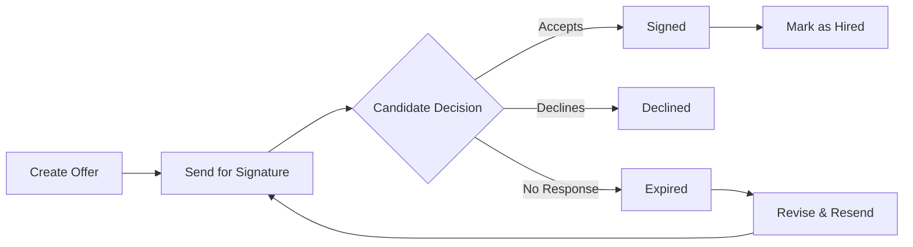

The Offers module in the ATS Platform handles the final and most consequential step of the hiring process — extending a formal offer to your chosen candidate and guiding it through to a signed agreement. You can generate professional PDF offer letters from reusable templates, fill in compensation details, send the offer directly to the candidate for secure electronic signature, and track the status of the offer in real time. Once an offer is accepted and signed, a single click converts the candidate into an employee record, closing the loop on the entire recruiting workflow.

<Info>
  The Offers module list view shows all outstanding and historical offers in a table with columns for Candidate Name, Job Title, Hiring Manager, Offer Sent Date, Expiry Date, and Status (Pending, Signed, Declined, or Expired). Status badges are color-coded — amber for Pending, green for Signed, red for Declined, and grey for Expired — so you can triage unsigned offers at a glance.
</Info>

## Creating and Sending an Offer Letter

The offer creation workflow takes you from selecting a template to delivering a signed document, all within the ATS Platform. Before you begin, ensure you have at least one offer letter template configured (see [Offer Templates](#offer-templates) below) and that the candidate's application is in a stage ready for an offer.

<Steps>
  <Step title="Open the Candidate Profile and Click 'Create Offer'">
    Navigate to the candidate's profile in the Candidates module. Click the **Create Offer** button located in the top-right action bar of the profile, or find it under the **Actions** dropdown menu. If the candidate has multiple active applications, you will be prompted to select which role the offer is for.
  </Step>
  <Step title="Select an Offer Template or Start from Scratch">
    Choose an existing offer letter template from the dropdown list — for example, "Standard Full-Time Offer" or "Engineering Contractor Agreement." The selected template will pre-populate the offer with your company's standard language, formatting, and variable placeholders. If you need a custom structure, select **Blank Offer** to start with an empty rich-text editor, or choose a template and then modify it for this specific offer without affecting the saved template.
  </Step>
  <Step title="Fill in Compensation Details">
    Complete the compensation fields for this offer. These values replace the corresponding variable placeholders in the template:
    - **Base Salary** — annual or hourly rate, with currency selector
    - **Bonus** — target annual bonus amount or percentage, if applicable
    - **Equity** — number of stock options or RSUs and vesting schedule, if applicable
    - **Start Date** — the candidate's proposed first day of employment
    - **Benefits Package** — select from your configured benefits tiers (e.g., "Standard", "Executive")
    - **Paid Time Off** — number of days/hours per year
    - **Offer Expiry Date** — the date by which the candidate must accept (see tip below)

    All filled fields are substituted into the offer letter document in real time.
  </Step>
  <Step title="Preview the Generated Offer Letter">
    Click **Preview PDF** to open a rendered preview of the final offer letter as it will appear to the candidate. Review all variable substitutions, formatting, and content carefully. If any field looks incorrect, close the preview and adjust the values before proceeding. You can also download the preview PDF to share with the Hiring Manager for approval before sending.
  </Step>
  <Step title="Send for Signature">
    Once the offer is finalized and approved, click **Send for Signature**. The candidate receives an email containing a secure, unique link to their offer letter. Clicking the link opens the document in the ATS Platform's built-in e-signature interface, where they can review the full offer letter and apply their electronic signature without needing to download, print, or install any software. No third-party e-signature account is required.
  </Step>
  <Step title="Track Signature Status">
    After sending, the offer enters the **Pending** status. You can monitor progress from the candidate's profile under the **Offers** tab, or from the Offers module in the main navigation. The status updates automatically:
    - **Pending** — the offer has been sent but the candidate has not yet signed
    - **Signed** — the candidate has applied their e-signature and accepted the offer
    - **Declined** — the candidate has declined the offer through the signing interface
    - **Expired** — the offer expiry date passed without a response

    You and the Hiring Manager receive an email notification when the status changes to Signed or Declined.
  </Step>
</Steps>

## Offer Flow

The diagram below illustrates the path an offer takes from creation through to hiring.

## Offer Templates

Offer templates allow you to standardize your offer letters so that every candidate for a given role type receives a consistent, legally reviewed document. Templates use variable placeholders that are automatically replaced with candidate-specific values when an offer is created.

**To create an offer template:**

1. Navigate to **Settings → Offer Templates → + New Template**.
2. Enter a template name (e.g., "Full-Time Employee — US", "UK Contractor Agreement").
3. Use the rich-text editor to write your offer letter content. Insert variable placeholders from the **Variables** panel on the right side of the editor by clicking the `+` button next to any variable name.
4. Click **Save Template**.

**Available variable placeholders:**

| Placeholder | Replaced With |
|---|---|
| `{{candidate_name}}` | The candidate's full name |
| `{{job_title}}` | The title of the role being offered |
| `{{department}}` | The department the candidate will join |
| `{{start_date}}` | The proposed start date entered in the offer form |
| `{{salary}}` | The base salary entered in the offer form |
| `{{bonus}}` | The target bonus amount or percentage |
| `{{equity}}` | The equity grant details |
| `{{benefits_package}}` | The name of the selected benefits tier |
| `{{pto_days}}` | The number of paid time off days |
| `{{offer_expiry_date}}` | The date the offer expires |
| `{{company_name}}` | Your organization's name, as set in Account Settings |
| `{{hiring_manager_name}}` | The name of the Hiring Manager for this role |
| `{{signing_date}}` | Automatically filled with the date the candidate signs |

<Info>
  The offer template editor presents a full-page rich-text editing area on the left and a Variables panel on the right listing all available placeholders (such as `{{candidate_name}}`, `{{salary}}`, and `{{start_date}}`). Clicking the `+` button next to any variable inserts it at the cursor position in the document. A live preview pane below the editor shows how the final offer letter will render when variable values are substituted.
</Info>

## Offer Statuses

Every offer in the system has one of four statuses that reflect where it stands in the acceptance lifecycle:

| Status | Description |
|---|---|
| **Pending** | The offer has been sent to the candidate and is awaiting their response. The offer letter is accessible via the candidate's unique signing link. |
| **Signed** | The candidate has reviewed and electronically signed the offer letter. A copy of the signed document is automatically saved to the candidate's Documents tab. |
| **Declined** | The candidate has formally declined the offer through the signing interface, or the Hiring Manager has manually marked it as declined after a verbal rejection. |
| **Expired** | The offer expiry date was reached without a response from the candidate. Expired offers are read-only but remain visible in the candidate's history for auditing purposes. |

If an offer is declined or expires, you can create a revised offer from the candidate's profile to extend a new or amended offer letter.

## Hiring a Candidate

Once an offer is signed, the candidate is formally ready to be converted into an employee record. This step closes out the candidate's application in the ATS Platform and transitions the record to your HRIS or onboarding system.

1. Open the candidate's profile. You will see a **Mark as Hired** banner at the top of the profile once the offer status is Signed.
2. Click **Mark as Hired**.
3. Confirm the hire by reviewing the start date and role. Optionally enter an employee ID if your HRIS assigns one at this stage.
4. Click **Confirm**. The candidate's application status changes to **Hired**, the job's "Active Candidates" count decreases by one, and the hire is recorded in your pipeline reports.

If your account is connected to an HRIS such as BambooHR or Workday (configured under **Settings → Integrations → HRIS**), clicking **Mark as Hired** will also automatically push the candidate's profile data to the HRIS to initiate the onboarding workflow, eliminating manual data re-entry.

<Tip>
  Set an **Offer Expiry Date** on every offer you send. A clearly communicated deadline creates a natural sense of urgency that encourages candidates to make a timely decision and prevents offers from sitting unresolved for weeks. For most roles, a 5–7 business day window is standard. The platform sends the candidate an automatic reminder email 24 hours before the expiry date if they have not yet signed or declined.
</Tip>

## Related Resources

<CardGroup cols={2}>
  <Card title="Candidate Management" icon="users" href="/manual/candidate-management">
    Manage candidate profiles and move applicants to the offer stage.
  </Card>
  <Card title="Email Templates" icon="envelope" href="/configuration/email-templates">
    Customize offer-related email notifications and reminder messages.
  </Card>
  <Card title="Account Setup" icon="gear" href="/configuration/account-setup">
    Configure your company name, logo, and HRIS integrations for offer letters.
  </Card>
  <Card title="Analytics" icon="chart-bar" href="/manual/reporting-analytics">
    Track offer acceptance rates and time-to-hire across your pipeline.
  </Card>
</CardGroup>
